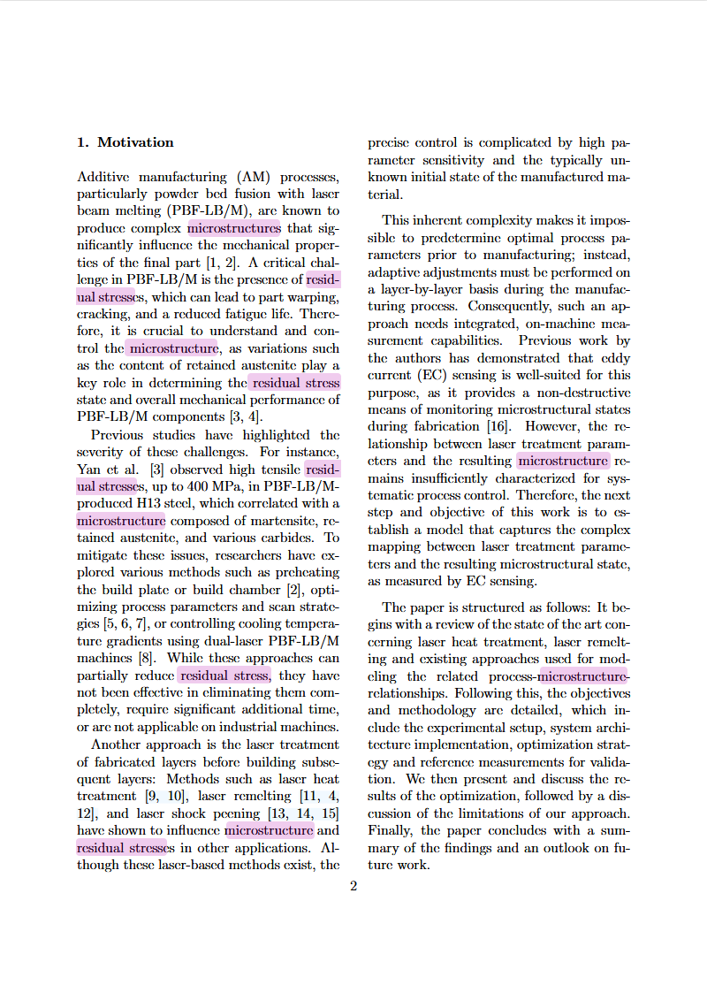
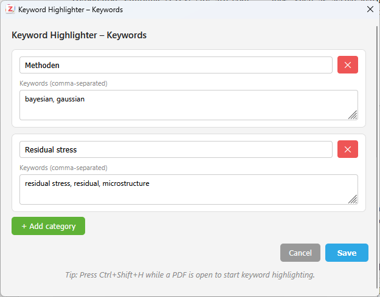

# Keyword Highlighter for Zotero

A Zotero plugin that automatically highlights user-defined keywords in the PDF reader — directly in the viewer, without saving annotations.



## Features

- Define keyword lists organized into named categories
- Highlight all keywords in the currently open PDF with a single shortcut (**Ctrl+Shift+H**)
- Keywords are highlighted using Zotero's built-in PDF search engine — no annotations are created
- Highlights are temporary and disappear when the PDF is closed, keeping your library clean
- Settings are saved persistently across sessions
- Supports **English, German, Spanish, and French**

## Installation

1. Download the latest `.xpi` file from the [Releases](../../releases/latest) page
2. In Zotero: **Tools → Add-ons → gear icon → Install Plugin From File**
3. Select the downloaded `.xpi` file and restart Zotero

## Usage

### 1. Set up your keywords

Go to **Tools → Keyword Highlighter…** to open the settings dialog.



- Click **+ Add category** to create a new keyword group
- Enter a category name (e.g. "Methods", "Results")
- Add comma-separated keywords in the text area below
- Click **Save**

### 2. Highlight keywords in a PDF

1. Open a PDF in the Zotero reader (double-click any PDF attachment)
2. Press **Ctrl+Shift+H**

All defined keywords will be highlighted immediately across the entire document.

> **Note:** Highlights are temporary — they disappear when the PDF is closed. Simply press Ctrl+Shift+H again after reopening.

## Requirements

- Zotero 7.0 or later (tested on Zotero 8)
- Windows, macOS, or Linux

## Building from source

Clone the repository and build the `.xpi` with one of the following commands:

**Windows** (requires [7-Zip](https://www.7-zip.org/)):
```powershell
& "C:\Program Files\7-Zip\7z.exe" a keyword-highlighter.xpi manifest.json bootstrap.js prefs.js chrome.manifest content\ locale\
```

**Linux / macOS:**
```bash
zip -r keyword-highlighter.xpi manifest.json bootstrap.js prefs.js chrome.manifest content/ locale/
```

### Project structure

```
keyword-highlighter/
├── manifest.json              # Plugin metadata
├── bootstrap.js               # Lifecycle hooks (startup/shutdown)
├── chrome.manifest            # Chrome URL registration
├── prefs.js                   # Default preferences
├── content/
│   ├── keywordHighlighter.js  # Main plugin logic
│   ├── settings.html          # Settings dialog UI
│   └── settings.js            # Settings dialog logic
└── locale/
    ├── en-US/                 # English
    ├── de-DE/                 # German
    ├── es-ES/                 # Spanish
    └── fr-FR/                 # French
```

### How it works

The plugin hooks into Zotero's internal pdf.js `findController` and dispatches a `find` event with all defined keywords as a query array. This triggers the same highlighting mechanism used by the built-in Ctrl+F search — without any modifications to the PDF file or Zotero's database.

## Contributing

Contributions are welcome! Feel free to open an issue or pull request for bug fixes, new languages, or feature suggestions.

## License

MIT License — see [LICENSE](LICENSE) for details.
